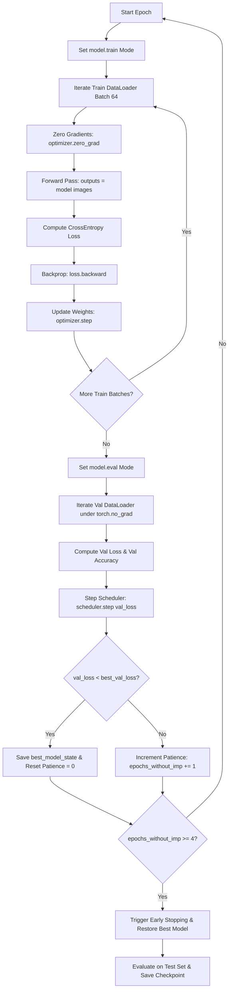

# Drowsiness Detection Using CNN — Comprehensive Project & Presentation Guide

---

## 📌 Executive Overview

This document provides an exhaustive, slide-by-slide technical guide for the **Drowsiness Detection Using CNN** project, derived strictly from the PyTorch implementation notebook `Drowsiness_Detection.ipynb`.

It covers:
1. **Detailed Slide Breakdown** (All 12 presentation slides explained step-by-step).
2. **Mathematical Foundations & Formulas** (Convolution operations, spatial output dimensions, parameter counting, normalization, activation functions, loss function, Adam optimization, and evaluation metrics).
3. **Deep Architecture Analysis** (Layer-by-layer parameter and tensor shape derivation for `DrowsinessCNN`).
4. **Training & Validation Workflow** (Data loading, augmentations, loss computation, backpropagation, learning rate scheduling, early stopping, and checkpoint restoration).
5. **Empirical Results & Per-Class Performance** (Confusion matrix analysis and metrics verification).

---

# 📖 Part 1: Slide-by-Slide Detailed Explanation

### SECTION 1 — Title Slide
- **Topic**: Project Introduction & Tech Stack.
- **Key Concepts**:
  - **Project Title**: Drowsiness Detection Using CNN — CNN-Based Active / Fatigue Classification.
  - **Framework & Hardware**: PyTorch `2.11.0+cu128`, CUDA acceleration on NVIDIA Tesla T4 GPU.
  - **Dataset Size**: 9,120 RGB facial image samples.
  - **Core Model**: `DrowsinessCNN` with **102,082 trainable parameters**.
  - **Final Test Performance**: **75.66% Accuracy** on unseen test images.
- **Presentation Tip**: Introduce the project as a lightweight, custom PyTorch deep learning model engineered for binary classification of human facial states (Active vs. Fatigue).

---

### SECTION 2 — Problem & Classification Task
- **Topic**: Problem Formulation & Binary Target Definition.
- **Workflow Pipeline**: $\text{Input Face Image} \rightarrow \text{Custom CNN Feature Extractor} \rightarrow \text{Binary Classification (2 Logits)}$.
- **Class Labels**:
  - **Active Subjects (Label 0)**: 4,560 images representing alert individuals with open eyes and responsive facial features.
  - **Fatigue Subjects (Label 1)**: 4,560 images representing drowsy/fatigued individuals with closed/heavy eyes or yawning signatures.
- **Presentation Tip**: Emphasize that the dataset is perfectly balanced (50/50), preventing class imbalance bias during training.

---

### SECTION 3 — Dataset Distribution & Stratified Splits
- **Topic**: Data Splitting Strategy.
- **Total Dataset**: 9,120 face images.
- **Random Seed**: Fixed `SEED = 42` for exact reproducibility across PyTorch, NumPy, Python `random`, and scikit-learn.
- **Stratified Train / Validation / Test Split**:
  - **Training Set (70%)**: 6,384 images (3,192 Active, 3,192 Fatigue).
  - **Validation Set (15%)**: 1,368 images (684 Active, 684 Fatigue).
  - **Test Set (15%)**: 1,368 images (684 Active, 684 Fatigue).
- **Presentation Tip**: Explain that stratification ensures every split maintains an exact 50% Active / 50% Fatigue ratio, eliminating split distribution drift.

---

### SECTION 4 — Data Preprocessing & Transformations
- **Topic**: Image Resizing, Augmentations, and PyTorch `DataLoader` Construction.
- **Pipeline Components**:
  1. `SquarePadResize(227)`: Pads rectangular face images (e.g., 1080×1920) into square dimensions using black borders (`fill=(0, 0, 0)`) without aspect ratio distortion, followed by bilinear interpolation resize to $227 \times 227$.
  2. **Data Augmentation (Train Set Only)**:
     - `RandomHorizontalFlip(p=0.5)`
     - `RandomRotation(degrees=10)`
     - `ColorJitter(brightness=0.2, contrast=0.2)`
  3. `ToTensor()` & `Normalize(mean=[0.5, 0.5, 0.5], std=[0.5, 0.5, 0.5])`: Converts PIL Image $[0, 255]$ to FloatTensor and normalizes pixel values to $[-1.0, 1.0]$.
- **Batch Specifications**:
  - **Batch Size**: 64
  - **Image Batch Tensor Shape**: `[64, 3, 227, 227]` (`torch.float32`)
  - **Label Batch Tensor Shape**: `[64]` (`torch.int64`)
  - **Num Workers**: 2 with `pin_memory=True`
  - **Batch Counts**: Train = 100 batches, Validation = 22 batches, Test = 22 batches.

---

### SECTION 5 — CNN Architecture (`DrowsinessCNN`)
- **Topic**: Structural Layout of `DrowsinessCNN`.
- **Model Topology**:
  - **Block 1**: `Conv2d(3, 32, k=3, p=1)` $\rightarrow$ `BatchNorm2d(32)` $\rightarrow$ `ReLU()` $\rightarrow$ `MaxPool2d(2, s=2)`
  - **Block 2**: `Conv2d(32, 64, k=3, p=1)` $\rightarrow$ `BatchNorm2d(64)` $\rightarrow$ `ReLU()` $\rightarrow$ `MaxPool2d(2, s=2)`
  - **Block 3**: `Conv2d(64, 128, k=3, p=1)` $\rightarrow$ `BatchNorm2d(128)` $\rightarrow$ `ReLU()` $\rightarrow$ `MaxPool2d(2, s=2)`
  - **Global Pooling**: `AdaptiveAvgPool2d((1, 1))` (Reduces $128 \times 28 \times 28 \rightarrow 128 \times 1 \times 1$)
  - **Classifier**: `Flatten()` $\rightarrow$ `Linear(128, 64)` $\rightarrow$ `ReLU()` $\rightarrow$ `Dropout(p=0.5)` $\rightarrow$ `Linear(64, 2)`
- **Parameter Count**: **102,082 Total & Trainable Parameters**.

---

### SECTION 6 — Forward Pass Tensor Transformation Flow
- **Topic**: Dimensional Progression of Tensors through Model.
- **Step-by-Step Shapes**:
  1. Input Image Batch: `[64, 3, 227, 227]`
  2. Post Block 1 (Conv 32 + MaxPool): `[64, 32, 113, 113]`
  3. Post Block 2 (Conv 64 + MaxPool): `[64, 64, 56, 56]`
  4. Post Block 3 (Conv 128 + MaxPool): `[64, 128, 28, 28]`
  5. Post Adaptive Average Pool: `[64, 128, 1, 1]`
  6. Post Flatten & Dense 64: `[64, 64]`
  7. Output Classification Logits: `[64, 2]` ($z_0 \rightarrow \text{Active}, z_1 \rightarrow \text{Fatigue}$)

---

### SECTION 7 — Training Setup & Execution Loop
- **Topic**: Hyperparameters, Optimizer, Scheduler, and Early Stopping.
- **Training Hyperparameters**:
  - **Maximum Epochs**: 15
  - **Loss Function**: `nn.CrossEntropyLoss()`
  - **Optimizer**: `torch.optim.Adam(lr=0.001, weight_decay=1e-4)`
  - **LR Scheduler**: `ReduceLROnPlateau(mode='min', factor=0.5, patience=2)`
  - **Early Stopping Policy**: Patience = 4 consecutive epochs without validation loss improvement.
- **Execution Workflow**:
  - Forward Pass $\rightarrow$ CrossEntropy Loss $\rightarrow$ Backprop (`loss.backward()`) $\rightarrow$ Adam Optimizer Step (`optimizer.step()`) $\rightarrow$ Validation Evaluation $\rightarrow$ LR Scheduler Step $\rightarrow$ Checkpoint Check (`val_loss < best_val_loss`).
  - **Outcome**: Early stopping triggered at **Epoch 13**. Best model state restored from **Epoch 09** (`best_val_loss = 0.4277`).

---

### SECTION 8 — Training Results & Epoch Metrics
- **Topic**: Training vs. Validation Loss and Accuracy Curves.
- **Key Epoch Highlights**:
  - **Epoch 01**: Train Loss 0.5677, Train Acc 72.09%, Val Loss 0.5624, Val Acc 70.76% (LR 0.001000)
  - **Epoch 05**: Train Loss 0.4560, Train Acc 77.27%, Val Loss 0.4420, Val Acc 76.24% (LR 0.001000)
  - **Epoch 09 (Best Checkpoint)**: Train Loss 0.4333, Train Acc 77.43%, **Val Loss 0.4277**, Val Acc 75.44% (LR 0.000500)
  - **Epoch 13 (Peak Accuracy / Early Stop)**: Train Loss 0.4161, Train Acc 78.16%, Val Loss 0.4342, **Val Acc 76.83%** (LR 0.000250)

---

### SECTION 9 — Test Evaluation & Confusion Matrix
- **Topic**: Unseen Test Set Performance.
- **Test Metric Summary**:
  - **Test Accuracy**: **75.66%** ($0.7565789$)
  - **Test Precision**: **73.56%** ($0.7355704$)
  - **Test Recall**: **80.12%** ($0.8011695$)
  - **Test F1 Score**: **76.70%** ($0.7669699$)
- **Confusion Matrix Breakdown** (1,368 total test images):
  - **True Active (TN)**: 487
  - **False Fatigue (FP)**: 197
  - **False Active (FN)**: 136
  - **True Fatigue (TP)**: 548
  - **Correct Classifications**: 1,035 / 1,368 ($75.66\%$)
  - **Misclassifications**: 333 / 1,368 ($24.34\%$)

---

### SECTION 10 — Per-Class Classification Performance
- **Topic**: Detailed Class Metrics (Active vs. Fatigue).
- **Active Subjects (Label 0)**:
  - Precision: **78.17%**
  - Recall: **71.20%**
  - F1 Score: **74.52%**
  - Support: 684 images
- **Fatigue Subjects (Label 1)**:
  - Precision: **73.56%**
  - Recall: **80.12%**
  - F1 Score: **76.70%**
  - Support: 684 images

---

### SECTION 11 — Final Model Inference Pipeline
- **Topic**: Production Inference Flow.
- **Pipeline Steps**:
  $\text{Input Image} \rightarrow \text{SquarePadResize(227) + Normalize} \rightarrow \text{DrowsinessCNN} \rightarrow \text{Logits [64, 2]} \rightarrow \text{Argmax} \rightarrow \text{Active / Fatigue}$

---

### SECTION 12 — Conclusion & Key Findings
- **Topic**: Project Summary.
- **Summary**:
  - End-to-end custom PyTorch CNN architecture trained on 9,120 images.
  - Achieved **75.66% Test Accuracy** and **80.12% Fatigue Recall**.
  - Restored best model weights at **Best Validation Loss = 0.4277**.

---

# 🧮 Part 2: Complete Mathematical Formulas & Derivations

## 1. Data Preprocessing & Normalization Formulas

### 1.1 Square Aspect Ratio Padding & Resize
Given an input image of width $W_{in}$ and height $H_{in}$, the max dimension is:
$$M = \max(W_{in}, H_{in})$$
The required top, bottom, left, and right zero-padding amounts are computed as:
$$P_{left} = \lfloor \frac{M - W_{in}}{2} \rfloor, \quad P_{right} = M - W_{in} - P_{left}$$
$$P_{top} = \lfloor \frac{M - H_{in}}{2} \rfloor, \quad P_{bottom} = M - H_{in} - P_{top}$$

Following padding to a square $M \times M$ image, bilinear interpolation resizes it to $W_{target} = 227, H_{target} = 227$:
$$I_{resized}(x', y') = \sum_{i=1}^2 \sum_{j=1}^2 w_{ij} I(x_i, y_j)$$

### 1.2 Channel-wise Normalization
With mean $\mu = [0.5, 0.5, 0.5]$ and standard deviation $\sigma = [0.5, 0.5, 0.5]$, each pixel channel value $x \in [0, 1]$ is normalized to $z \in [-1.0, 1.0]$:
$$z_c = \frac{x_c - \mu_c}{\sigma_c} = \frac{x_c - 0.5}{0.5} = 2 x_c - 1.0$$

---

## 2. Convolutional Neural Network (CNN) Formulas

### 2.1 Spatial Output Dimension Formula (Conv2D & MaxPool2D)
For a spatial dimension size $W$, kernel size $K$, padding $P$, and stride $S$, the output spatial dimension $O$ is:
$$O = \left\lfloor \frac{W - K + 2P}{S} \right\rfloor + 1$$

- **Conv2d ($K=3, P=1, S=1$)**:
  $$O = \left\lfloor \frac{W - 3 + 2(1)}{1} \right\rfloor + 1 = W \quad (\text{Spatial size preserved})$$
- **MaxPool2d ($K=2, P=0, S=2$)**:
  $$O = \left\lfloor \frac{W - 2}{2} \right\rfloor + 1 = \left\lfloor \frac{W}{2} \right\rfloor$$

### 2.2 Layer Spatial Dimension Calculations
1. **Input Batch**: $227 \times 227 \times 3$
2. **Block 1 Conv2D ($3 \rightarrow 32, K=3, P=1, S=1$)**: $227 \times 227 \times 32$
   - **Block 1 MaxPool ($K=2, S=2$)**: $\lfloor \frac{227 - 2}{2} \rfloor + 1 = 113 \rightarrow 113 \times 113 \times 32$
3. **Block 2 Conv2D ($32 \rightarrow 64, K=3, P=1, S=1$)**: $113 \times 113 \times 64$
   - **Block 2 MaxPool ($K=2, S=2$)**: $\lfloor \frac{113 - 2}{2} \rfloor + 1 = 56 \rightarrow 56 \times 56 \times 64$
4. **Block 3 Conv2D ($64 \rightarrow 128, K=3, P=1, S=1$)**: $56 \times 56 \times 128$
   - **Block 3 MaxPool ($K=2, S=2$)**: $\lfloor \frac{56 - 2}{2} \rfloor + 1 = 28 \rightarrow 28 \times 28 \times 128$
5. **AdaptiveAvgPool2d((1, 1))**: Spatially averages each feature map over $28 \times 28 \rightarrow 1 \times 1 \times 128$.

### 2.3 Layer Activation & Batch Normalization Formulas
- **ReLU Activation**:
  $$f(x) = \max(0, x)$$
- **Batch Normalization (BatchNorm2d)**:
  $$\hat{x}_i = \frac{x_i - \mu_B}{\sqrt{\sigma_B^2 + \epsilon}}$$
  $$y_i = \gamma \hat{x}_i + \beta$$
  Where $\gamma$ and $\beta$ are learnable scale and shift parameters per channel.

---

## 3. Detailed Model Parameter Derivation (102,082 Parameters)

### 3.1 Layer Parameter Formulas
- **Conv2D Parameters**:
  $$P_{\text{conv}} = (K_w \times K_h \times C_{\text{in}} + 1) \times C_{\text{out}}$$
- **BatchNorm2D Parameters**:
  $$P_{\text{bn}} = 2 \times C_{\text{channels}} \quad (\text{Learnable } \gamma, \beta)$$
- **Linear Layer Parameters**:
  $$P_{\text{linear}} = (N_{\text{in}} + 1) \times N_{\text{out}}$$

### 3.2 Step-by-Step Parameter Counting

| Layer Component | Operation / Configuration | Parameter Calculation Formula | Exact Parameter Count |
| :--- | :--- | :--- | :--- |
| **Block 1 Conv** | `Conv2d(3, 32, kernel_size=3, padding=1)` | $(3 \times 3 \times 3 + 1) \times 32 = 28 \times 32$ | **896** |
| **Block 1 BN** | `BatchNorm2d(32)` | $2 \times 32$ | **64** |
| **Block 2 Conv** | `Conv2d(32, 64, kernel_size=3, padding=1)` | $(3 \times 3 \times 32 + 1) \times 64 = 289 \times 64$ | **18,496** |
| **Block 2 BN** | `BatchNorm2d(64)` | $2 \times 64$ | **128** |
| **Block 3 Conv** | `Conv2d(64, 128, kernel_size=3, padding=1)` | $(3 \times 3 \times 64 + 1) \times 128 = 577 \times 128$ | **73,856** |
| **Block 3 BN** | `BatchNorm2d(128)` | $2 \times 128$ | **256** |
| **Classifier FC1**| `Linear(128, 64)` | $(128 + 1) \times 64 = 129 \times 64$ | **8,256** |
| **Classifier FC2**| `Linear(64, 2)` | $(64 + 1) \times 2 = 65 \times 2$ | **130** |
| **TOTAL** | **DrowsinessCNN Total Parameters** | **Sum of all layers above** | **102,082** |

$$\text{Total Parameters} = 896 + 64 + 18496 + 128 + 73856 + 256 + 8256 + 130 = \mathbf{102,082}$$

---

## 4. Loss Function & Optimizer Formulas

### 4.1 Cross-Entropy Loss (`nn.CrossEntropyLoss()`)
For a mini-batch of $N$ samples with class logits $z_i = [z_{i,0}, z_{i,1}]$ and ground truth labels $y_i \in \{0, 1\}$:

The Softmax probability for class $k \in \{0, 1\}$ is:
$$p_{i, k} = \frac{e^{z_{i, k}}}{e^{z_{i, 0}} + e^{z_{i, 1}}}$$

The Cross-Entropy Loss for the batch is:
$$\mathcal{L} = -\frac{1}{N} \sum_{i=1}^N \log(p_{i, y_i})$$

### 4.2 Adam Optimizer with Weight Decay (`torch.optim.Adam`)
Adam updates parameter weights $\theta$ at step $t$ with learning rate $\alpha = 0.001$, weight decay $\lambda = 10^{-4}$, and exponential decay rates $\beta_1 = 0.9, \beta_2 = 0.999$:

1. **Gradient with Weight Decay**:
   $$g_t = \nabla_\theta \mathcal{L}(\theta_t) + \lambda \theta_t$$
2. **First & Second Moment Estimates**:
   $$m_t = \beta_1 m_{t-1} + (1 - \beta_1) g_t$$
   $$v_t = \beta_2 v_{t-1} + (1 - \beta_2) g_t^2$$
3. **Bias Corrections**:
   $$\hat{m}_t = \frac{m_t}{1 - \beta_1^t}, \quad \hat{v}_t = \frac{v_t}{1 - \beta_2^t}$$
4. **Parameter Update Rule**:
   $$\theta_{t+1} = \theta_t - \frac{\alpha}{\sqrt{\hat{v}_t} + \epsilon} \hat{m}_t \quad (\epsilon = 10^{-8})$$

### 4.3 Learning Rate Scheduler (`ReduceLROnPlateau`)
Monitors validation loss ($\text{val\_loss}$). If no improvement is observed for `patience = 2` epochs:
$$\alpha_{\text{new}} = \alpha_{\text{old}} \times \text{factor} = \alpha_{\text{old}} \times 0.5$$

---

## 5. Performance Evaluation Metric Formulas

Given the Confusion Matrix parameters:
- $\text{TP}$ = True Positives (Actual Fatigue, Predicted Fatigue) = **548**
- $\text{TN}$ = True Negatives (Actual Active, Predicted Active) = **487**
- $\text{FP}$ = False Positives (Actual Active, Predicted Fatigue) = **197**
- $\text{FN}$ = False Negatives (Actual Fatigue, Predicted Active) = **136**

### 5.1 Overall Accuracy
$$\text{Accuracy} = \frac{\text{TP} + \text{TN}}{\text{TP} + \text{TN} + \text{FP} + \text{FN}} = \frac{548 + 487}{1368} = \frac{1035}{1368} \approx \mathbf{75.66\%}$$

### 5.2 Fatigue Class (Positive Class = 1) Metrics
- **Precision**:
  $$\text{Precision}_{\text{Fatigue}} = \frac{\text{TP}}{\text{TP} + \text{FP}} = \frac{548}{548 + 197} = \frac{548}{745} \approx \mathbf{73.56\%}$$
- **Recall**:
  $$\text{Recall}_{\text{Fatigue}} = \frac{\text{TP}}{\text{TP} + \text{FN}} = \frac{548}{548 + 136} = \frac{548}{684} \approx \mathbf{80.12\%}$$
- **F1 Score**:
  $$\text{F1}_{\text{Fatigue}} = 2 \times \frac{\text{Precision} \times \text{Recall}}{\text{Precision} + \text{Recall}} = 2 \times \frac{0.73557 \times 0.80117}{0.73557 + 0.80117} \approx \mathbf{76.70\%}$$

### 5.3 Active Class (Negative Class = 0) Metrics
- **Precision**:
  $$\text{Precision}_{\text{Active}} = \frac{\text{TN}}{\text{TN} + \text{FN}} = \frac{487}{487 + 136} = \frac{487}{623} \approx \mathbf{78.17\%}$$
- **Recall**:
  $$\text{Recall}_{\text{Active}} = \frac{\text{TN}}{\text{TN} + \text{FP}} = \frac{487}{487 + 197} = \frac{487}{684} \approx \mathbf{71.20\%}$$
- **F1 Score**:
  $$\text{F1}_{\text{Active}} = 2 \times \frac{0.7817 \times 0.7120}{0.7817 + 0.7120} \approx \mathbf{74.52\%}$$

---

# 🔄 Part 3: Step-by-Step Model Training Procedure

### Explanation of the Training Loop:
1. **Mode Switching**: Before training iterations, `model.train()` is invoked to enable `BatchNorm` running updates and `Dropout(p=0.5)`.
2. **Gradient Zeroing**: `optimizer.zero_grad()` clears accumulated tensor gradients from previous iterations.
3. **Forward & Backward Pass**: Input batch `[64, 3, 227, 227]` passes through feature extractor and classifier to produce logits `[64, 2]`. `loss.backward()` calculates partial derivatives $\frac{\partial \mathcal{L}}{\partial \theta}$.
4. **Optimization Step**: `optimizer.step()` applies Adam parameter updates using gradient momentum estimates and weight decay.
5. **Validation Phase**: `model.eval()` disables Dropout and freezes BatchNorm stats. Execution runs inside `torch.no_grad()` to prevent memory consumption and computational overhead.
6. **Adaptive Scheduler**: `scheduler.step(val_loss)` reduces learning rate by factor $0.5$ if validation loss plateaus.
7. **Checkpoint Restoration**: If `val_loss` reaches a new minimum, `best_model_state = copy.deepcopy(model.state_dict())` saves the model parameters. If early stopping triggers (Epoch 13), `model.load_state_dict(best_model_state)` guarantees that evaluation is performed on the optimal model checkpoint (Epoch 09).
